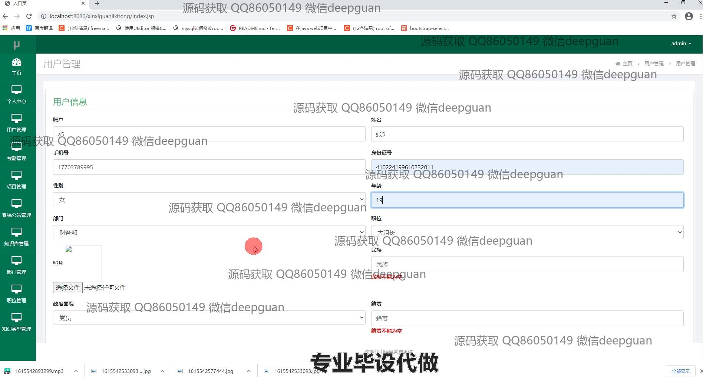
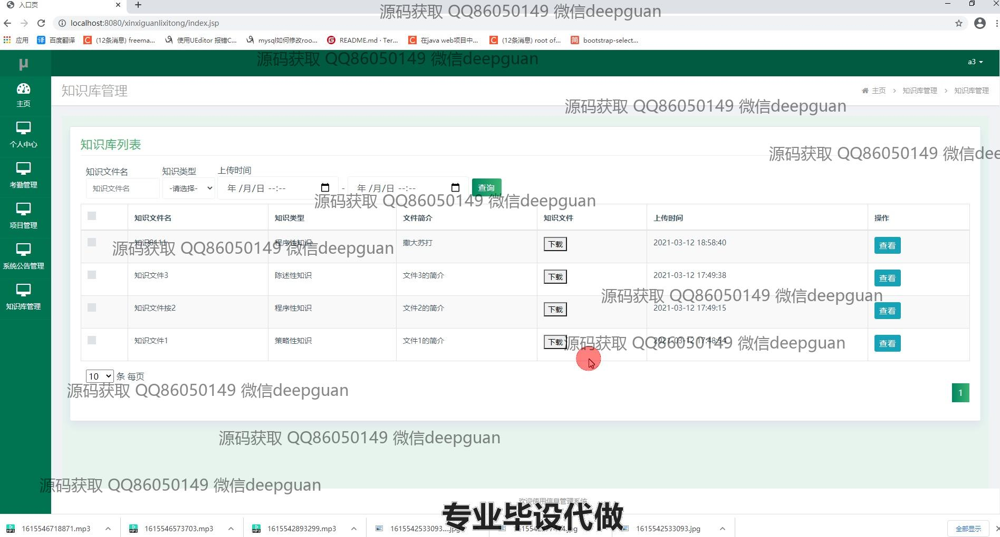

<h1 align="center">北京集联软件科技有限公司信息管理系统</h1>

## 简介
北京集联软件科技有限公司信息管理系统：角色分为管理员、用户；功能包括修改密码、用户管理、考勤管理、项目管理、知识库管理、系统公告管理。    --计算机毕业设计源码；毕设源码；java毕业设计源码

## 联系方式

<h3 align="center">获取完整代码与数据库文件 + 微信：deepguan QQ: 86050149 QQ群: 783742310</h3>

<h3 align="center">可帮忙远程部署 包运行成功！提供远程部署、修改代码、设计文档指导、代码讲解等服务！</h3>

## 功能介绍（完整见运行截图）
管理员：登录和管理权限分配功能。信息管理包括用户管理、考勤管理、项目管理及系统公告管理，可执行增删改查操作。管理系统公告及知识库类型，通过直观界面快速进行查询、添加和删除。实时考勤数据管理，包括打卡记录查询、加班时长计算及迟到早退标记。项目管理中提供项目信息编辑、文件上传和进度监控功能，增强项目数据处理效率。

用户：实现平台登录和注册功能，进入系统后可访问个人中心修改个人信息和密码。考勤管理功能帮助查看个人打卡记录，及时掌握出勤状态。知识库管理提供文件查看和下载功能，通过同一界面管理不同知识类型的文档。项目管理允许用户查看和更新参与项目的信息及进度，上传相关文件辅助项目协作。系统为用户提供直观的界面及易于操作的各类管理功能。

## 运行截图

本代码来源于网络,仅供学习参考使用!

